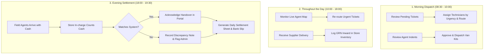

# Sri Balaji Renewables (SBR) - Store In-Charge Role & Feature Specification

## Overview
This document defines the comprehensive Role-Based Access Control (RBAC), daily workflows, operational boundaries, and technical roadmap for introducing the **Store In-Charge** role into the SBR ecosystem (Backend, Web Portal, Android, and iOS).

---

## 1. Role Definition & Purpose
The **Store In-Charge** role is designed to empower branch and warehouse managers to oversee daily field service logistics, manage inventory indents and van kits, coordinate technician dispatches, and reconcile daily physical cash collections without risking core system governance, master pricing, or audit trails.

### Core Distinctions
| Dimension | Super Admin | Store In-Charge | Field Agent |
| :--- | :--- | :--- | :--- |
| **Primary Focus** | Business governance, pricing, global analytics & system settings | Store inventory, technician dispatch, cash handovers, local operations | Field service execution, customer site visits, parts consumption |
| **Service Tickets** | Full CRUD + hard delete | View, assign, create walk-in, update status | Assigned tickets only, update job status & parts |
| **Warehouse Inventory** | Full control + write-offs | GRN inward, van kit transfer, indent approval, live audits | Request parts indent, view van stock |
| **Cash & Payments** | Final verification, waiver, ledger adjustments | Count & acknowledge physical cash, flag discrepancies | Collect customer payment, handover cash |
| **Catalog & Pricing** | Manage MRP, taxes, add/delete products | View specs, adjust stock bin locations | View parts catalog |
| **User & Access** | Full account creation, suspension, role assignment | Onboard field agents (if enabled) | Self profile |
| **System Settings** | SMS, Push, Payment Gateways, API keys | Restricted / Hidden | None |

---

## 2. Feature & RBAC Matrix Summary

### 1. Dispatch & Service Tickets
- **Ticket Queue & Filters**: Full access to filter by status (`Pending`, `Assigned`, `In-Progress`, `Completed`, `Cancelled`), date, priority, and technician.
- **Technician Assignment**: Full authority to assign open tickets or re-route jobs based on technician workload and proximity.
- **Manual Ticket Creation**: Allowed for call-in / walk-in retail store customers.
- **Ticket Deletion**: **Restricted (Admin Only)** to protect audit trails.
- **Live Agent Map**: Interactive Leaflet map tracking active field technicians.

### 2. Inventory & Van Stock Management
- **Central Stock Tracking**: Real-time inventory visibility across Solar, Softeners, Valves, Spares, and Kits with low-stock warnings.
- **Material Inward (GRN)**: Log incoming supplier shipments, PO numbers, batches, and received quantities.
- **Stock Outward / Van Kit Transfers**: Transfer stock from central warehouse directly to technician mobile kits.
- **Agent Indents Approval**: Authorize or reject parts replenishment requests from technicians before debiting warehouse stock.
- **Live Van Stock Audits**: Inspect real-time stock balances inside field vehicles and reconcile consumption against closed tickets.
- **Damaged & Scrap Logging**: Log physical receipt of defective parts; write-off approvals require Super Admin.

### 3. Cash Collection & Financial Settlement
- **Review Cash Handovers**: Inspect daily pending cash collected by field technicians per job.
- **Acknowledge & Record Discrepancies**: Physical note verification; record exact cash received; mandatory notes on variance.
- **Audit Ledger & Exports**: Export daily settlement sheets to Excel/CSV for accounting.
- **Bank Deposit Logging**: Record daily cash drop reference / deposit slip into bank account.
- **Financial Record Alteration**: **Restricted (Admin Only)** — no retro-active edits or waivers allowed for Store In-Charge.

### 4. Technician & Customer Management
- **Technician Directory**: View status, active jobs, ratings, and phone numbers.
- **Onboarding**: Ability to register new field agents.
- **Suspension / Deletion**: **Restricted (Admin Only)**.
- **Customer Database**: View customer history, add walk-ins, bulk upload (append-only); deletion restricted to Admin.

---

## 3. Daily Operational Workflows

---

## 4. Technical Implementation Roadmap for Next Session

### Phase 1: Backend (`sbr-backend`)
1. **User Schema**: Update `role` enum in `User.js` to include `'store_incharge'`.
2. **Middleware**: Add `isStoreInchargeOrAdmin` and `authorizeRoles(['admin', 'store_incharge'])` guards to `authMiddleware.js`.
3. **Inventory & Handover APIs**:
   - `POST /api/inventory/grn-inward`
   - `POST /api/inventory/van-transfer`
   - `PUT /api/agent-cash-handover/:id/acknowledge`
   - `POST /api/finance/bank-deposit`

### Phase 2: Web Portal (`sbr web`)
1. **Navigation & Sidebar**: Filter visible tabs based on role:
   - Store In-charge sees: `Dashboard`, `Dispatch & Tickets`, `Live Map`, `Store Inventory`, `Van Stock & Indents`, `Cash Handovers`, `Technicians`, `Customer DB`.
   - Hidden from Store In-charge: `Pricing Master`, `System Settings`, `Delete Actions`, `Blog Management`.
2. **Dedicated Store In-charge View**: Quick action cards for "Pending Indents", "Open Dispatches", and "Unsettled Field Cash".

### Phase 3: Mobile Apps (`sbr android` & `sbr ios`)
1. Add role-aware dashboard for Store In-charge login (or default web portal for tablet/desktop use).

---

## 5. Artifacts & Deliverables Generated
- `SBR_Store_Incharge_Role_Features_Matrix.xlsx` — Formatted Excel workbook with 4 sheets (Feature Matrix, Daily Workflows, Security Boundaries, Technical Specs).
- `Role_&_Feature_Matrix.csv` — Raw CSV data for system integration.
- `Store_Incharge_Workflows.csv` — Operational step-by-step checklist.
- `Security_&_Boundaries.csv` — Risk mitigation and boundary definitions.
- `generate_excel_matrix.py` — Automated Python script with openpyxl styling engine.
