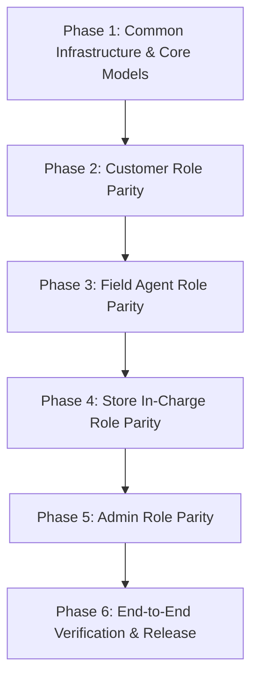

# Complete Phased Strategy: Full iOS to Android Parity Plan (android_ios_replica)

Replicate the complete feature set, workflows, user interfaces, real-time GPS tracking, and business logic from the **SBR iOS App** into the **SBR Android App (Jetpack Compose & Material 3)** across all 4 user roles without altering or missing any detail.

---

## Architecture & Tech Stack Parity

| Layer | iOS Implementation | Target Android Implementation |
| :--- | :--- | :--- |
| **Language & UI** | Swift, SwiftUI | Kotlin, Jetpack Compose, Material 3 |
| **Architecture** | MVVM + Combine / Async-Await | MVVM + Hilt / ViewModels + StateFlow / Coroutines |
| **Networking** | `APIClient` (URLSession + Codable) | Retrofit 2 + OkHttp 3 + Gson / Moshi |
| **Mapping & Location** | MapKit + CoreLocation (`CLLocationManager`) | Google Maps Compose SDK + FusedLocationProviderClient |
| **Realtime Sync** | Socket.IO Client / Polling | Socket.IO Android Client (`socket.io-client-java`) |
| **Image Handling** | SwiftUI PhotosPicker / AsyncImage | Coil Compose (`rememberAsyncImagePainter`) + ActivityResultContracts |
| **Local Storage** | UserDefaults + Keychain | EncryptedSharedPreferences / Jetpack DataStore |

---

## User-Wise Phased Implementation Roadmap

---

## Phase 1: Core Models, Network & Shared Components

### 1.1 Data Models Parity
Ensure all Android Kotlin data classes match the exact JSON schemas and iOS models:
- [CashHandover.kt](file:///d:/SBR%20Final/sbr%20android/app/src/main/java/com/sbr/sms/data/models/CashHandover.kt): Support flexible deserialization for `AgentDailySummary` (`totalCollectedCash`/`totalCash`, `completedJobsCount`/`requestCount`, `hasSubmittedHandover`/`alreadySubmitted`, `latestHandover`/`existingHandover`).
- [ServiceRequest.kt](file:///d:/SBR%20Final/sbr%20android/app/src/main/java/com/sbr/sms/data/models/ServiceRequest.kt): Full support for coordinates `[Double]` (`latitude`, `longitude`), `requestReview`, `requiredComponents`, `inventoryTotal`, `serviceCharge`, `discount`, `beforeImageUrl`, `afterImageUrl`, `paymentTimestamp`, and `JobTimer`.
- [AgentIndent.kt](file:///d:/SBR%20Final/sbr%20android/app/src/main/java/com/sbr/sms/data/models/AgentIndent.kt): Part indents requisition models with urgency enum (`LOW`, `MEDIUM`, `HIGH`, `CRITICAL`).
- [Referral.kt](file:///d:/SBR%20Final/sbr%20android/app/src/main/java/com/sbr/sms/data/models/Referral.kt): Referral claims, payout methods (`UPI`, `BANK_TRANSFER`, `CASH_STORE`), and statuses.

### 1.2 Shared UI Components
- **MapPinPickerSheet / Dialog** ([MapPinPickerSheet.swift](file:///d:/SBR%20Final/sbr%20ios/SBR/SBR/Views/Components/MapPinPickerSheet.swift) parity):
  - Google Map with central draggable pin.
  - "Use GPS" quick button querying device `FusedLocationProviderClient`.
  - Android `Geocoder` reverse geocoding to auto-fill address, building/door number, and landmark.
- **JobTimerView** ([JobTimerView.swift](file:///d:/SBR%20Final/sbr%20ios/SBR/SBR/Views/Components/JobTimerView.swift) parity):
  - Real-time job timer displaying active work duration, start time, pause/resume, and completed duration badges.
- **Unified Image Picker & Compressor**:
  - Multi-part camera and gallery launcher with image compression before upload to `/api/upload`.

---

## Phase 2: Customer Role Parity

### 2.1 Customer Service Request & GPS Address Booking
- **Request Creation with GPS Coordinates** ([CustomerDashboardView.swift](file:///d:/SBR%20Final/sbr%20ios/SBR/SBR/Views/CustomerDashboardView.swift) parity):
  - Option to select service type, description, preferred date/time slot.
  - Interactive Map / GPS pin selector saving `latitude` and `longitude` in `ServiceRequest`.
  - Address book management with saved addresses ([AddEditAddressSheet.swift](file:///d:/SBR%20Final/sbr%20ios/SBR/SBR/Views/Customer/AddEditAddressSheet.swift) parity).

### 2.2 In-App Live Agent Tracking for Customer
- **CustomerLiveTrackingScreen** ([CustomerLiveTrackingView.swift](file:///d:/SBR%20Final/sbr%20ios/SBR/SBR/Views/Customer/CustomerLiveTrackingView.swift) parity):
  - Full-screen Google Map showing Customer Location pin and Agent live moving marker with custom avatar.
  - Socket.IO live stream (`agent:location:update`) + fallback polling.
  - Agent card: photo, name, phone dialer, vehicle/specialization info, ETA, and distance display.
  - Live service request progress tracker (Pending -> Assigned -> In Progress -> Completed).

### 2.3 Payments, Referrals & Support
- **CustomerPaymentsScreen** ([CustomerPaymentsView.swift](file:///d:/SBR%20Final/sbr%20ios/SBR/SBR/Views/Customer/CustomerPaymentsView.swift) parity):
  - View invoices, payment receipt breakdown, service charge, inventory components used, and download receipt.
- **ReferAndEarnScreen** ([ReferAndEarnView.swift](file:///d:/SBR%20Final/sbr%20ios/SBR/SBR/Views/Customer/ReferAndEarnView.swift) parity):
  - Referral code card with 1-tap copy & share sheet.
  - Earnings wallet balance, active referrals history, and Claim Reward dialog (UPI, Bank, Cash Handover).
- **CustomerSupportScreen** ([CustomerSupportView.swift](file:///d:/SBR%20Final/sbr%20ios/SBR/SBR/Views/Customer/CustomerSupportView.swift) parity):
  - Quick WhatsApp, phone helpline, email support, and FAQ accordion.

---

## Phase 3: Field Agent Role Parity

### 3.1 Job Assessment, Van Kit Verification & Acceptance
- **Stock Shortage Assessment Alert** ([AgentDashboardView.swift](file:///d:/SBR%20Final/sbr%20ios/SBR/SBR/Views/AgentDashboardView.swift) parity):
  - When accepting a job with required components, check van kit inventory.
  - If insufficient parts, display modal with shortage count and direct shortcut to "Raise Indent to Store In-Charge".

### 3.2 In-App Live Turn-by-Turn Navigation & Route
- **AgentLiveCustomerRouteScreen** ([AgentLiveCustomerRouteView.swift](file:///d:/SBR%20Final/sbr%20ios/SBR/SBR/Views/Agent/AgentLiveCustomerRouteView.swift) parity):
  - Stay completely inside the app (no redirection required).
  - Google Directions API integration drawing polyline from Agent live GPS position to Customer coordinates.
  - Dynamic navigation banner: next turn instruction, distance remaining (km/m), ETA in minutes.
  - Real-time GPS heading rotation and map recenter button.
  - Quick action floating bar: "Call Customer", "Open in External Maps" fallback, and "Arrived at Location".

### 3.3 Job Execution, Before/After Photos & Completion Flow
- **Before & After Photo Uploads**:
  - Live camera capture of equipment before service and after service with visual confirmation.
- **Payment & Close Options Dialog** ([RequestDetailView.swift](file:///d:/SBR%20Final/sbr%20ios/SBR/SBR/Views/Details/RequestDetailView.swift) parity):
  - Record payment method (Cash, UPI, Card), inventory components used, service charge, and discounts.
  - Two distinct completion buttons:
    1. `Collect & Close (No Review)`
    2. `Collect, Close & Request Review` (triggers customer email & push notification with Google Review URL).

### 3.4 EOD Cash Handover & Van Kit Indents
- **AgentCashHandoverScreen** ([CashHandoverView.swift](file:///d:/SBR%20Final/sbr%20ios/SBR/SBR/Views/Agent/CashHandoverView.swift) parity):
  - Daily summary card showing Today's Cash collections and completed jobs count.
  - EOD Submission form with denomination breakdown notes.
  - Handover status tracker (`SUBMITTED`, `ACKNOWLEDGED`, `DISCREPANCY`) with Store In-Charge feedback notes.
- **AgentInventoryScreen** ([AgentInventoryView.swift](file:///d:/SBR%20Final/sbr%20ios/SBR/SBR/Views/Agent/AgentInventoryView.swift) parity):
  - View van stock levels, low-stock badges, and "Raise Indent" dialog with urgency level selection.

---

## Phase 4: Store In-Charge Role Parity

### 4.1 Store In-Charge 4-Tab Console ([StoreInchargeDashboardView.swift](file:///d:/SBR%20Final/sbr%20ios/SBR/SBR/Views/StoreIncharge/StoreInchargeDashboardView.swift) parity)
- **Tab 1: Dispatch Queue**:
  - List unassigned/pending requests with 1-tap agent assignment dropdown.
- **Tab 2: Live Agent GPS Tracking Map**:
  - Google Map showing all active field agents with live location pins, agent details, and current assigned job.
- **Tab 3: Indents Requisition Queue**:
  - View agent part requisitions, urgency badge, required quantities.
  - "Dispatch to Van" (approves & deducts main warehouse inventory / adds to agent inventory) and "Reject" actions.
- **Tab 4: EOD Cash Reconciliation**:
  - View pending agent cash submissions.
  - Reconcile modal sheet: enter actual cash received, notes, calculate shortage/excess discrepancy, and settle handover.

---

## Phase 5: Admin Role Parity

### 5.1 Admin Console & Multi-Agent Fleet Monitoring
- **AdminMultiAgentMapScreen** ([AdminMultiAgentMapView.swift](file:///d:/SBR%20Final/sbr%20ios/SBR/SBR/Views/Admin/AdminMultiAgentMapView.swift) parity):
  - Real-time fleet overview map with agent status filters (All, Active, Busy, Offline).
- **ServiceRequestsScreen & Assignment**:
  - Full filterable list of all service requests, re-assignment modal, and manual creation dialog.
- **Payments & Revenue Analytics** ([PaymentsView.swift](file:///d:/SBR%20Final/sbr%20ios/SBR/SBR/Views/Admin/PaymentsView.swift) parity):
  - Total Revenue & Today's Collections summary cards.
  - Transaction history list with detailed receipt modal and CSV export date-range picker.
- **Customer & Agent Management** ([CustomerManagementView.swift](file:///d:/SBR%20Final/sbr%20ios/SBR/SBR/Views/Admin/CustomerManagementView.swift), [AgentManagementView.swift](file:///d:/SBR%20Final/sbr%20ios/SBR/SBR/Views/Admin/AgentManagementView.swift)):
  - Full CRUD operations: add/edit customers, activate/deactivate agents, edit specializations.
- **AdminReferralsScreen & Settings** ([AdminReferralsView.swift](file:///d:/SBR%20Final/sbr%20ios/SBR/SBR/Views/Admin/AdminReferralsView.swift), [AdminSettingsView.swift](file:///d:/SBR%20Final/sbr%20ios/SBR/SBR/Views/Admin/AdminSettingsView.swift)):
  - Approve/reject referral reward claims.
  - Configure Google Review URL and system parameters.

---

## Verification & Parity Checklist

### Automated & Build Verification
- [ ] Run `./gradlew assembleDebug` in `sbr android` to ensure complete compilation without errors.
- [ ] Verify lint and model serialization tests against live backend endpoints.

### Side-by-Side User Role Walkthrough
1. **Customer Flow**: Register/Login -> Place Request with GPS Map Pin -> View live Agent on map -> Receive review prompt on job completion.
2. **Agent Flow**: Accept Request -> In-App Live Turn-by-Turn Route -> Arrive -> Upload Before/After Photos -> Close with Review -> Submit EOD Cash Handover.
3. **Store In-Charge Flow**: Assign Request -> Track Field Agents live -> Approve/Dispatch Indents -> Reconcile & Settle EOD Cash Handover.
4. **Admin Flow**: View Fleet Map -> Export Payments CSV -> Manage Users & Agents -> Review Settings URL.
